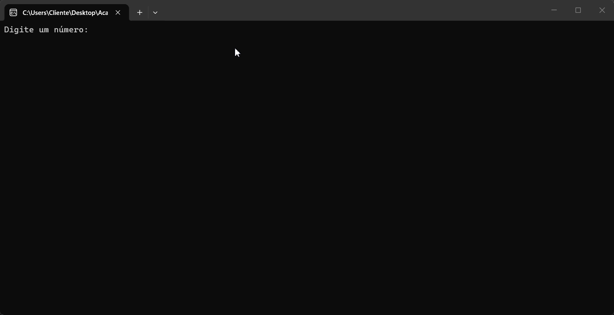

# Cheque por Extenso

Sistema desenvolvido para converter valores numéricos em valores escritos por extenso, simulando o preenchimento de cheques bancários.  
O objetivo do projeto é praticar lógica de programação, manipulação numérica e estruturas condicionais utilizando C#.

Desenvolvido por **Iago** durante o curso Fullstack da [Academia do Programador](https://www.academiadoprogramador.net) em 2026.



---

# Funcionalidades

## Conversão Numérica
- Conversão de números para texto por extenso
- Leitura de valores inteiros
- Escrita automática em português
- Conversão de unidades
- Conversão de dezenas
- Conversão de centenas
- Conversão de milhares
- Conversão de milhões

---

## Regras Aplicadas
- Tratamento especial para números entre 10 e 19
- Tratamento especial para o número 100 ("Cem")
- Separação correta utilizando "e"
- Exibição correta de singular e plural:
  - "real"
  - "reais"
  - "milhão"
  - "milhões"

---

# Estrutura Utilizada

O sistema utiliza:
- Vetores para armazenar os números por extenso
- Estruturas condicionais
- Operadores matemáticos
- Divisão e módulo para separação de casas numéricas

---

# Como Utilizar o Projeto

1. Clone o repositório ou baixe o projeto em `.zip`

2. Abra o projeto em sua IDE:
- Visual Studio
- Visual Studio Code

3. Execute o projeto:

     ```
     dotnet restore
     ```

4. Em seguida compile e execute o projeto com o comando: 

    ```
    dotnet run --project ChequePorEntenso.Console.App
    ```

## Requistitos

* .NET SDK 10.0